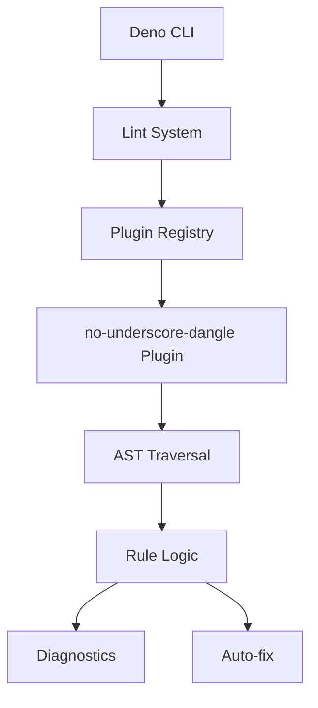
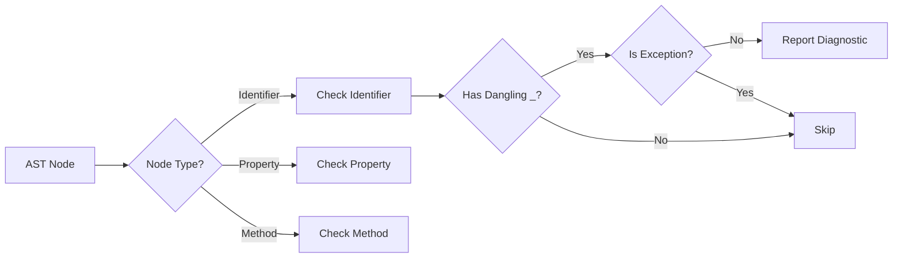
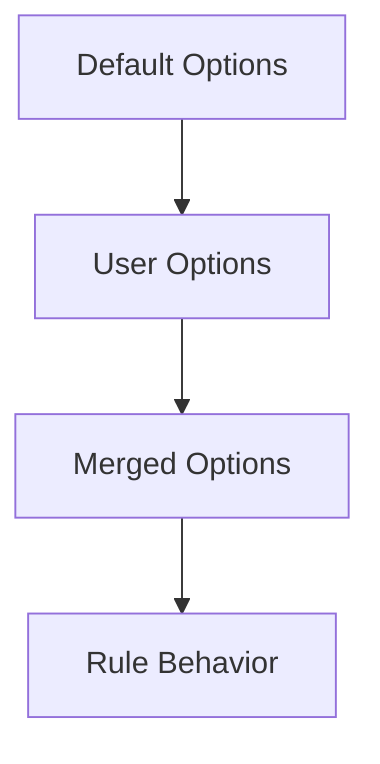
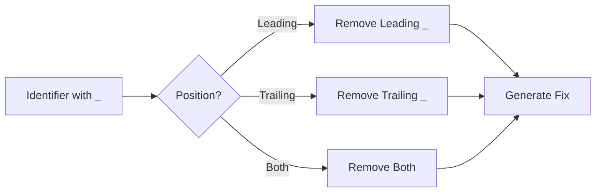

# System Patterns: Deno No Underscore Dangle

## Architecture Overview

このプラグインは、Deno の lint システムのプラグインとして動作します。基本的なアーキテクチャは次のとおりです：



## Core Components

### 1. プラグイン定義（`plugin.ts`）

- プラグインのメタデータと設定スキーマの定義
- ルールの作成関数（AST 訪問者を返す）
- オプション処理ロジック

### 2. ユーティリティ関数（`utils.ts`）

- 識別子の検証ロジック
- 特殊名のチェック
- その他のヘルパー関数

### 3. モジュールエントリポイント（`mod.ts`）

- プラグインのエクスポート
- 外部向け API の定義

### 4. テスト（`tests/`）

- ルールの動作検証
- 各オプションの動作確認
- エッジケースの処理

## Design Patterns

### Visitor Pattern

AST（抽象構文木）を走査する際に、Visitor パターンを使用してノードを処理します。

```typescript
{
    Identifier(node) { /* ... */ },
    PropertyDefinition(node) { /* ... */ },
    MethodDefinition(node) { /* ... */ }
}
```

### Strategy Pattern

さまざまなコンテキストに応じた識別子の処理ロジックを分離しています：

- 通常の識別子の処理
- クラスフィールドの処理
- メソッド名の処理
- プロパティ名の処理

### Factory Pattern

設定に基づいてカスタマイズされたルールインスタンスを作成します：

```typescript
create(context) {
    // オプションを処理して適切なルール動作を構成
    return { /* visitor オブジェクト */ };
}
```

## Key Workflows

### 1. ルール適用フロー



### 2. 設定処理フロー



### 3. 自動修正フロー



## Technical Decisions

### 1. 型定義

- パフォーマンスと開発体験のバランスを考慮し、いくつかの場所で `any` 型を使用
- 将来的には専用の型定義に置き換える予定

### 2. オプション設計

- すべてのオプションはブール値またはシンプルな型で、理解と使用が容易
- デフォルトオプションは一般的なユースケースをカバー

### 3. エラー修正

- シンプルな自動修正を提供
- 識別子のリネームに関連する複雑なリファクタリングは避ける

### 4. テスト戦略

- 各ルールとオプションの組み合わせに対する単体テスト
- JSDoc コメントを使ってテストコード内にオプション設定を埋め込む

## Improvement Areas

1. **型安全性**: `any` 型を具体的な型に置き換える
2. **コンテキスト取得方法**: `context.getParent` のバグを修正
3. **テストの拡充**: より多くのエッジケースをカバー
4. **パフォーマンス最適化**: AST 走査の効率化
